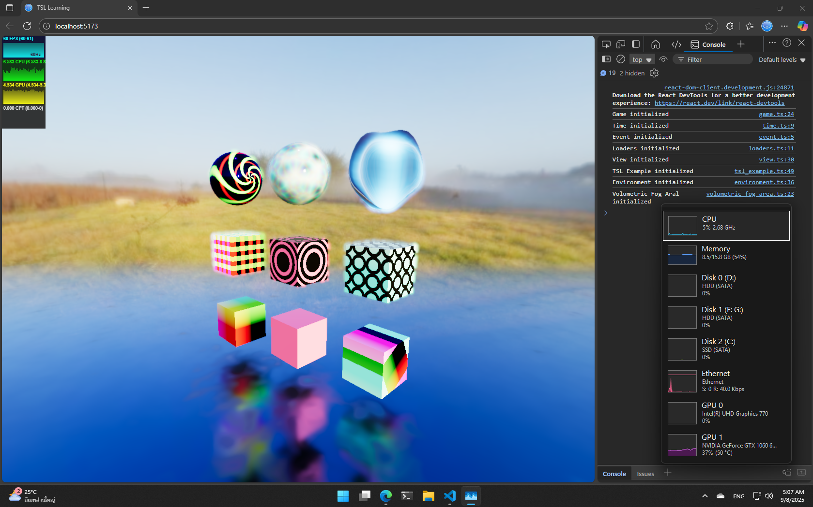

# Three.js WebGPU TSL Example

This project demonstrates how to use **Three.js** with **WebGPU** and **TSL (Three Shader Language)**.  
It is designed with a **flexible structure** and is especially suitable for beginners who want to explore writing shaders with TSL.

---

## 🌐 Demo

👉 [Live Demo Here](https://bagidea.github.io/three-webgpu-tsl-example)

---

## 📸 Preview

---

## 📂 File Structure

- `src/tsl_example.ts`  
  Contains a collection of **simple TSL examples** in a single file.  
  It shows how to work with geometry, materials, and basic node usage.
